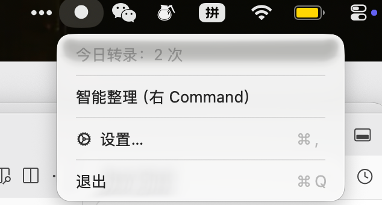
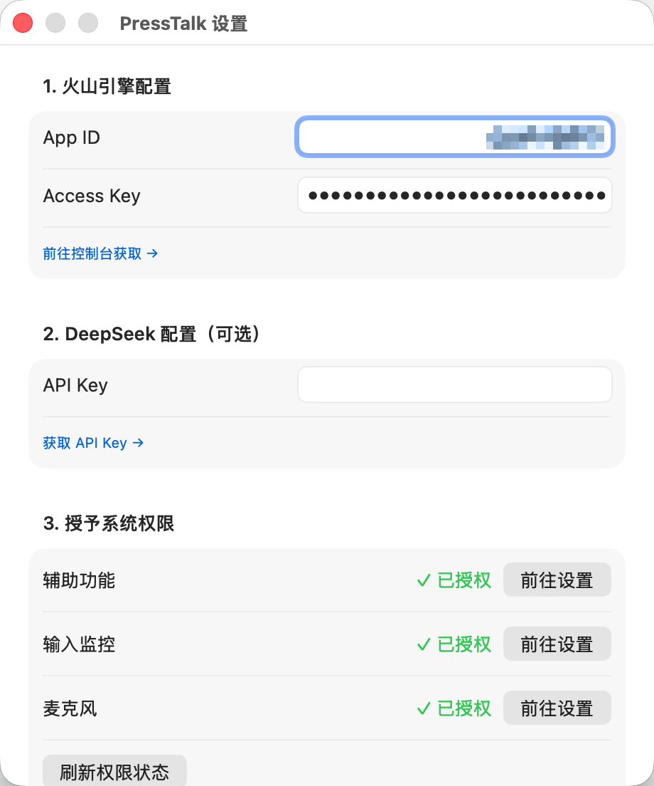

# PressTalk

PressTalk 是一个原生 macOS 菜单栏语音输入工具。按住右 `Option` 说话，松开后自动转录并输入到当前光标位置；按住右 `Command` 时，会在转录后再经过 DeepSeek 做轻量整理。





## 核心能力

| 操作 | 效果 |
|------|------|
| 按住右 `Option`，说话，松开 | 转录并输入文字 |
| 按住右 `Command`，说话，松开 | 转录 + 智能整理后输入 |

- 转录后端：火山引擎豆包 ASR `bigmodel_nostream`
- 形态：原生 Swift 菜单栏 App
- 状态图标：`●` 待机 / `◉` 录音中 / `◌` 转录中 / `✓` 完成

## 推荐使用方式

最顺手的流程是：

1. 用 Xcode 构建出 `PressTalk.app`
2. 把 `PressTalk.app` 拖到 `/Applications`
3. 从 `/Applications/PressTalk.app` 启动
4. 填写 API Key
5. 授予辅助功能、输入监控、麦克风权限

这样授权会绑定到固定路径，后续使用最稳定。

## 注意：从 VoiceInput 升级到 PressTalk

`PressTalk` 是新的 App 身份，不会继承旧版 `VoiceInput` 的辅助功能和输入监控权限。

升级后请重新为 `PressTalk.app` 授权：

- 辅助功能：系统设置 → 隐私与安全性 → 辅助功能
- 输入监控：系统设置 → 隐私与安全性 → 输入监控
- 麦克风：系统设置 → 隐私与安全性 → 麦克风

如果你已经在系统里完成授权，但界面仍未立刻更新，先回到 App 看状态是否自动刷新；如果仍未更新，退出并重新打开 `PressTalk.app`。

## 配置

首次启动后，打开菜单栏中的“设置…”，填写：

- 火山引擎 `App ID`
- 火山引擎 `Access Key`
- DeepSeek API Key（可选）

获取地址：

- 火山引擎语音识别控制台：https://console.volcengine.com/speech/service/10038
- DeepSeek API Keys：https://platform.deepseek.com/api_keys

## 构建

### Xcode

直接打开 [PressTalk.xcodeproj](/Users/baokker/Work/vibe_coding_projects/my_voice_input_swift/PressTalk.xcodeproj) 并运行 `PressTalk` scheme。

### 命令行构建

```bash
xcodebuild -project PressTalk.xcodeproj \
  -scheme PressTalk \
  -configuration Release \
  -derivedDataPath /tmp/PressTalkDerived \
  build CODE_SIGNING_ALLOWED=NO
```

构建产物：

```bash
/tmp/PressTalkDerived/Build/Products/Release/PressTalk.app
```

打包未签名发布版：

```bash
ditto -c -k --sequesterRsrc --keepParent \
  /tmp/PressTalkDerived/Build/Products/Release/PressTalk.app \
  PressTalk-release.zip
```

首次在其他机器运行未签名版本时，可能需要右键打开；如果被隔离属性阻止，可执行：

```bash
xattr -dr com.apple.quarantine PressTalk.app
```

## 仓库结构

```
.
├── PressTalk.xcodeproj
├── PressTalk
│   ├── PressTalkApp.swift
│   ├── AppDelegate.swift
│   ├── AppState.swift
│   ├── Services
│   ├── UI
│   ├── Helpers
│   ├── Info.plist
│   └── PressTalk.entitlements
├── README.md
└── ROADMAP.md
```

# TODO

目前发现最后的测试连接功能还有一点小问题，有空再修复

# 相关博客

后面会写一篇博客，讲讲 Vibe Coding 这个项目的动机和心得，但是现在先拖着。